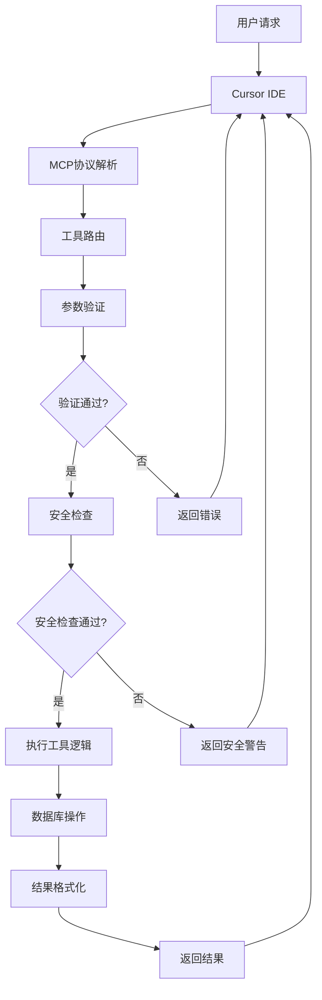

# 🔬 MySQL MCP服务器技术原理详解

本文档深入解析MySQL MCP服务器的工作原理，帮助开发者理解MCP协议和服务器内部机制。

## 📋 目录

- [MCP协议概述](#mcp协议概述)
- [系统架构设计](#系统架构设计)
- [数据流转机制](#数据流转机制)
- [工具注册与调用](#工具注册与调用)
- [数据库连接管理](#数据库连接管理)
- [安全机制](#安全机制)
- [与Cursor IDE集成](#与cursor-ide集成)
- [核心代码解析](#核心代码解析)

## 🌐 MCP协议概述

### 什么是MCP？

MCP（Model Context Protocol）是一个开放协议，用于在AI助手和外部工具/数据源之间建立标准化通信。

### MCP核心概念

```
┌─────────────────┐    JSON-RPC     ┌─────────────────┐
│   AI Assistant  │ ←─────────────→ │  MCP Server     │
│   (Cursor IDE)  │   双向通信      │  (MySQL Server) │
└─────────────────┘                 └─────────────────┘
         ↓                                    ↓
    用户交互                           外部数据源操作
    (聊天界面)                        (数据库操作)
```

### MCP通信特点

- **标准化协议**: 使用JSON-RPC 2.0格式
- **双向通信**: AI助手可以调用工具，工具可以返回结果
- **类型安全**: 强类型的数据结构和参数验证
- **异步处理**: 支持异步操作和状态管理

## 🏗️ 系统架构设计

### 整体架构图

```
┌─────────────────────────────────────────────────────────┐
│                    MySQL MCP Server                     │
├─────────────────────────────────────────────────────────┤
│  ┌─────────────────┐  ┌─────────────────┐  ┌─────────────┐ │
│  │  工具处理器     │  │  连接管理器     │  │ 安全检查器  │ │
│  │ Tool Handlers   │  │ Connection Mgr  │  │ Security    │ │
│  └─────────────────┘  └─────────────────┘  └─────────────┘ │
├─────────────────────────────────────────────────────────┤
│  ┌─────────────────┐  ┌─────────────────┐  ┌─────────────┐ │
│  │   数据格式化    │  │   错误处理      │  │ 日志记录    │ │
│  │ Data Formatter  │  │ Error Handler   │  │ Logger      │ │
│  └─────────────────┘  └─────────────────┘  └─────────────┘ │
├─────────────────────────────────────────────────────────┤
│  ┌─────────────────────────────────────────────────────┐ │
│  │              MySQL数据库连接层                       │ │
│  │        mysql-connector-python                       │ │
│  └─────────────────────────────────────────────────────┘ │
└─────────────────────────────────────────────────────────┘
           ↓                           ↓
    ┌─────────────┐             ┌─────────────┐
    │  Cursor IDE │             │  其他MCP   │
    │   客户端    │             │   客户端    │
    └─────────────┘             └─────────────┘
```

### 核心组件说明

1. **工具处理器（Tool Handlers）**
   - 处理具体业务逻辑
   - 参数验证和类型检查
   - 结果格式化

2. **连接管理器（Connection Manager）**
   - 数据库连接生命周期管理
   - 连接池管理
   - 连接状态维护

3. **安全检查器（Security Checker）**
   - SQL注入防护
   - 操作权限验证
   - 安全警告显示

## 🔄 数据流转机制

### 请求处理流程



### 工具调用示例

```
1. 用户在Cursor中输入：
   "查询users表中的前10条记录"

2. Cursor将请求转换为MCP格式：
   {
     "tool": "execute_query",
     "arguments": {
       "query": "SELECT * FROM users LIMIT 10",
       "max_rows": 10
     }
   }

3. MCP服务器处理：
   - 解析请求
   - 验证参数
   - 检查安全
   - 执行查询
   - 格式化结果

4. 返回结果：
   {
     "result": "查询成功！返回 10 行数据：\n\nid | name | email\n1 | 张三 | zhang@example.com\n..."
   }
```

## 🛠️ 工具注册与调用

### 工具定义结构

每个工具都包含以下要素：

```python
{
    "name": "工具名称",
    "description": "工具描述",
    "inputSchema": {
        "type": "object",
        "properties": {
            "参数1": {"type": "类型", "description": "描述"},
            "参数2": {"type": "类型", "default": 默认值}
        },
        "required": ["必需参数列表"]
    }
}
```

### 工具注册机制

```python
# 在 mysql_mcp_tools.py 中定义
TOOLS = [
    types.Tool(
        name="execute_query",
        description="执行SELECT查询",
        inputSchema={...}
    ),
    types.Tool(
        name="connect_database",
        description="连接数据库",
        inputSchema={...}
    ),
    # ... 更多工具
]

# 在主服务器中注册
class MySQLMCPServer:
    def __init__(self):
        self.tools = TOOLS  # 注册所有工具
        self.connection_manager = MySQLConnectionManager()
```

### 工具调用处理

```python
async def handle_tool_call(tool_name: str, arguments: dict):
    """统一的工具调用入口"""
    
    # 1. 工具路由
    if tool_name == "connect_database":
        return await self.handle_connect_database(**arguments)
    elif tool_name == "execute_query":
        return await self.handle_execute_query(**arguments)
    # ... 其他工具
    
    # 2. 工具不存在
    return f"❌ 未知工具: {tool_name}"
```

## 🔗 数据库连接管理

### 连接管理器设计

```python
class MySQLConnectionManager:
    def __init__(self):
        self.connection: Optional[mysql.connector.MySQLConnection] = None
        self.config: Optional[DatabaseConfig] = None
    
    @contextmanager
    def get_connection(self, config: DatabaseConfig):
        """上下文管理器，确保连接正确关闭"""
        self.config = config
        try:
            self.connection = mysql.connector.connect(
                host=config.host,
                port=config.port,
                database=config.database,
                user=config.username,
                password=config.password,
                charset=config.charset,
                use_pure=True,
                ssl_disabled=not config.use_ssl
            )
            yield self.connection
        except Error as e:
            logger.error(f"MySQL连接错误: {e}")
            raise
        finally:
            if self.connection and self.connection.is_connected():
                self.connection.close()
```

### 连接生命周期

```
1. 创建连接 (connect_database)
   ↓
2. 存储连接配置
   ↓
3. 验证连接状态
   ↓
4. 工具使用连接执行操作
   ↓
5. 自动关闭连接 (上下文管理器)
```

### 连接复用机制

```python
class MySQLMCPServer:
    def __init__(self):
        self.connection_manager = MySQLConnectionManager()
        self.connection = None  # 缓存当前连接
    
    async def handle_execute_query(self, query: str):
        # 复用现有连接
        with self.connection_manager.get_connection(
            self.connection_manager.config
        ) as conn:
            cursor = conn.cursor(dictionary=True)
            cursor.execute(query)
            results = cursor.fetchall()
            cursor.close()
            return results
```

## 🔒 安全机制

### 多层安全防护

```
┌─────────────────────────────────────────────────┐
│                安全防护层级                      │
├─────────────────────────────────────────────────┤
│ 1. 参数验证    →  类型检查、必填字段验证         │
│ 2. SQL检查     →  只允许SELECT查询               │
│ 3. 写操作确认  →  双重确认机制                  │
│ 4. 开发警告    →  每次使用显示安全提醒           │
│ 5. 权限控制    →  数据库用户权限限制            │
└─────────────────────────────────────────────────┘
```

### SQL注入防护

```python
def validate_sql_safety(query: str) -> bool:
    """SQL安全性检查"""
    query_upper = query.strip().upper()
    
    # 只允许SELECT语句进行直接查询
    if not query_upper.startswith('SELECT'):
        return False
    
    # 检查危险关键字（扩展用）
    dangerous_keywords = ['DROP', 'DELETE', 'UPDATE', 'INSERT']
    for keyword in dangerous_keywords:
        if keyword in query_upper:
            return False
    
    return True
```

### 写操作确认流程

```python
async def handle_execute_write_operation(self, sql: str):
    """写操作需要确认"""
    
    # 第一步：检测写操作
    write_keywords = ['INSERT', 'UPDATE', 'DELETE', 'CREATE', 'ALTER', 'DROP']
    is_write_operation = any(
        sql.strip().upper().startswith(keyword) 
        for keyword in write_keywords
    )
    
    if not is_write_operation:
        return "❌ 不是写操作语句"
    
    # 第二步：返回确认信息
    return f"""
    ⚠️  危险操作确认 ⚠️
    
    检测到您准备执行写操作：
    {sql[:200]}...
    
    此操作将修改数据库！
    请确认：
    1. 您理解这是不可逆的操作
    2. 您已经在开发环境中
    3. 您已经备份了重要数据
    4. 您确认要执行此操作
    
    如需继续，请回复 "确认执行"
    """

async def handle_confirmed_write_operation(self, sql: str):
    """确认后执行写操作"""
    # 只有在用户明确确认后才执行
    try:
        with self.connection_manager.get_connection(...) as conn:
            cursor = conn.cursor()
            cursor.execute(sql)
            affected_rows = cursor.rowcount
            conn.commit()
            return f"✅ 写操作执行成功！影响行数: {affected_rows}"
    except Error as e:
        return f"❌ 写操作失败: {str(e)}"
```

## 🎯 与Cursor IDE集成

### MCP服务器注册

```json
{
  "mcpServers": {
    "mysql-mcp-server": {
      "command": "python3",
      "args": ["/path/to/mysql_mcp_server.py"],
      "cwd": "/path/to/mysql",
      "env": {
        "PYTHONPATH": "/path/to/mysql"
      }
    }
  }
}
```

### 工具发现机制

```
1. Cursor启动时读取MCP配置
   ↓
2. 启动MCP服务器进程
   ↓
3. 通过JSON-RPC协议获取工具列表
   ↓
4. 在聊天界面中显示可用工具
   ↓
5. 用户选择工具并提供参数
```

### 实时通信

```python
# 主函数 - 标准MCP服务器入口
async def main():
    async with mcp.server.stdio.stdio_server() as (read_stream, write_stream):
        await server.run(
            read_stream,
            write_stream,
            InitializationOptions(
                server_name="mysql-mcp-server",
                server_version="1.0.0",
                capabilities=server.get_capabilities(
                    notification_options=None,
                    experimental_capabilities={},
                ),
            ),
        )
```

## 💻 核心代码解析

### 1. 服务器初始化

```python
class MySQLMCPServer:
    def __init__(self):
        self.connection_manager = MySQLConnectionManager()
        self.dev_warning_shown = False  # 防止重复显示警告
    
    def show_dev_warning(self) -> str:
        """显示开发环境安全警告"""
        if not self.dev_warning_shown:
            self.dev_warning_shown = True
            return """
⚠️  安全警告 ⚠️

此MySQL MCP服务器仅应在开发环境中使用！
- 不应在生产环境中使用此工具
- 使用前请确保数据库中的数据可以安全修改
- 建议使用专门的测试数据库
- 定期备份重要数据

继续使用即表示您理解并接受此风险。
"""
        return ""
```

### 2. 工具处理器模式

```python
async def handle_execute_query(self, query: str, max_rows: int = 1000):
    """工具处理器模板"""
    
    # 1. 显示安全警告
    warning = self.show_dev_warning()
    
    # 2. 检查前置条件
    if not self.connection_manager.connection:
        return f"{warning}❌ 请先连接数据库"
    
    # 3. 安全检查
    query_upper = query.strip().upper()
    if not query_upper.startswith('SELECT'):
        return f"{warning}❌ 只允许执行SELECT查询"
    
    # 4. 执行操作
    try:
        with self.connection_manager.get_connection(...) as conn:
            cursor = conn.cursor(dictionary=True)
            cursor.execute(query)
            results = cursor.fetchall()
            cursor.close()
            
            # 5. 格式化结果
            if not results:
                return f"{warning}查询成功，但没有返回任何数据。"
            
            output = f"{warning}查询成功！返回 {len(results)} 行数据：\n\n"
            
            # 显示列名
            columns = list(results[0].keys())
            output += " | ".join(columns) + "\n"
            output += "-" * (len(" | ".join(columns))) + "\n"
            
            # 显示数据
            for row in results[:max_rows]:
                values = [str(row[col]) for col in columns]
                output += " | ".join(values) + "\n"
            
            return output
            
    except Error as e:
        return f"{warning}❌ 查询执行失败: {str(e)}"
```

### 3. 错误处理机制

```python
def handle_error(self, error: Exception, context: str) -> str:
    """统一错误处理"""
    
    error_type = type(error).__name__
    error_message = str(error)
    
    if isinstance(error, mysql.connector.Error):
        if error.errno == 1045:  # Access denied
            return f"❌ 数据库访问被拒绝，请检查用户名和密码"
        elif error.errno == 2003:  # Can't connect
            return f"❌ 无法连接到数据库服务器，请检查主机和端口"
        else:
            return f"❌ MySQL错误 ({error.errno}): {error_message}"
    else:
        logger.error(f"{context} 发生错误: {error}", exc_info=True)
        return f"❌ 发生未知错误: {error_message}"
```

## 📊 性能优化

### 1. 连接复用

- 缓存数据库连接
- 使用上下文管理器自动关闭
- 连接超时管理

### 2. 查询优化

- 限制返回行数（max_rows参数）
- 查询结果分页支持
- 预编译语句（防止SQL注入）

### 3. 内存管理

- 结果集分批处理
- 及时关闭游标和连接
- 避免大数据量一次性返回

## 🔍 监控和调试

### 日志记录

```python
import logging

# 配置日志
logging.basicConfig(
    level=logging.INFO,
    format='%(asctime)s - %(name)s - %(levelname)s - %(message)s',
    handlers=[
        logging.FileHandler('mysql_mcp.log'),
        logging.StreamHandler()
    ]
)

logger = logging.getLogger("mysql-mcp-server")
```

### 状态监控

```python
def get_server_status(self) -> dict:
    """获取服务器状态"""
    return {
        "connection_active": self.connection_manager.connection is not None,
        "database": self.connection_manager.config.database if self.connection_manager.config else None,
        "host": self.connection_manager.config.host if self.connection_manager.config else None,
        "warning_shown": self.dev_warning_shown,
        "uptime": time.time() - self.start_time
    }
```

---

**总结**: MySQL MCP服务器通过标准化的MCP协议，将复杂的数据库操作封装为简单的工具调用，实现了AI助手与数据库之间的无缝集成。其设计充分考虑了安全性、易用性和可维护性，为开发者提供了强大的数据库操作能力。
